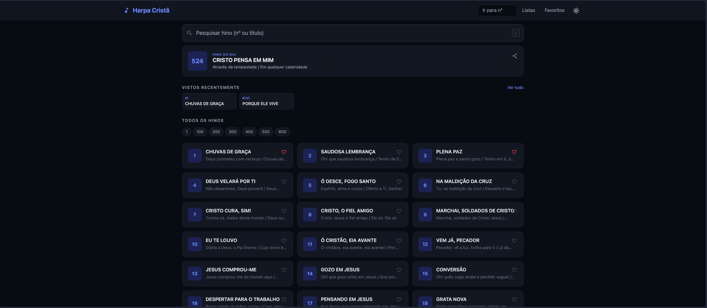
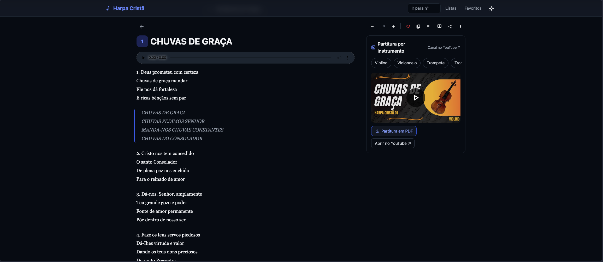
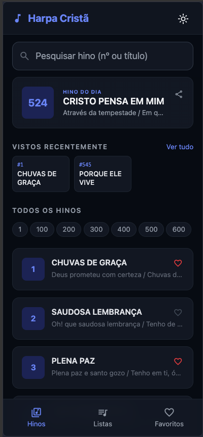
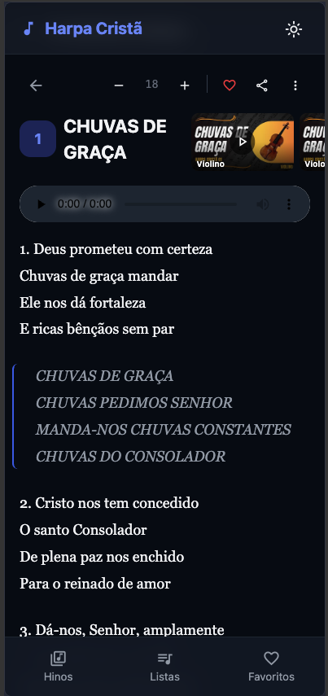
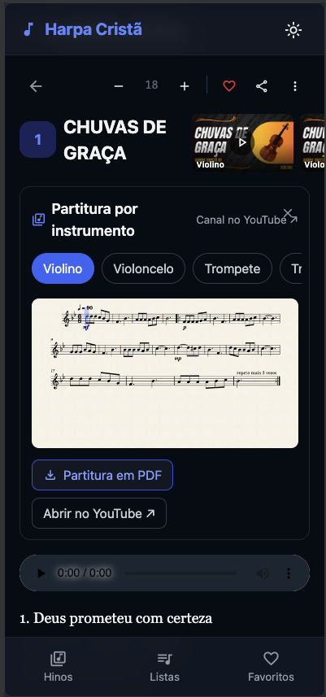
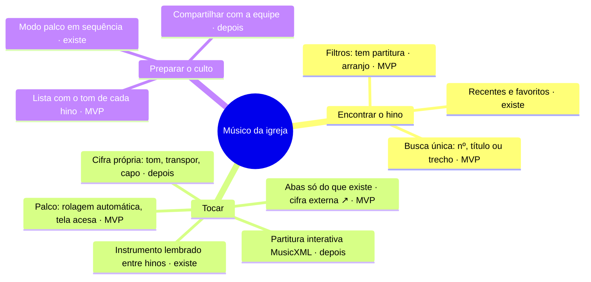
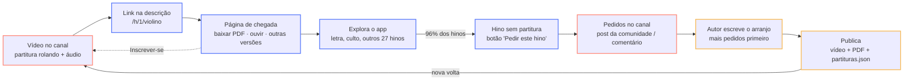

# Revisão de UX/UI — Harpa Cristã Online

> Outubro de 2026. Objetivo do produto: ser o **Cifra Club + Musescore dos hinos da Harpa Cristã**.
> As telas propostas estão em [`telas-propostas.pdf`](telas-propostas.pdf) (12 páginas): diagnóstico desktop e mobile, mapa do produto, ciclo canal ↔ app e as 8 telas da proposta — home, hino só com letra, hino com partitura, página de chegada do YouTube, culto, cifra, partitura interativa e o desktop com painel de ferramentas.

## 1. Decisões que guiam a revisão

| Tema | Decisão |
|---|---|
| Usuário principal | **Músico da igreja** (ensaio e culto). Leitor e líder de louvor vêm depois. |
| Cifra | Hoje só **link externo**. Cifra própria (com transposição) fica para a Fase 2. |
| Partitura | Banco próprio, publicado no canal [Harpa Cristã Partituras](https://www.youtube.com/@harpacristapartituras) (do autor do app). Partitura nativa/interativa (MusicXML) na Fase 2. |
| Comunidade | **Sem conteúdo colaborativo dentro do app** por enquanto (complexidade). A comunidade vive no canal; o app manda pedidos e inscritos para lá. |

### O que existe hoje nos dados

- 640 hinos com letra (`data/*.txt`).
- **28 hinos com partitura** (~4%) em `data/partituras.json`: 163 versões, sendo 123 melodias e 40 arranjos.
- Instrumentos: violino, violoncelo, trompete e trombone (28 cada), quarteto de cordas (22), quarteto de metais (16) e casos pontuais (viola, sax alto, bombardino, piano, quintetos).

**Consequência de design:** a tela "padrão" de um hino é **só letra** (96% dos casos). A UI deve mostrar apenas o que existe, sem abas vazias.

## 2. Diagnóstico das telas atuais

Severidade: 🔴 alta · 🟠 média · 🔵 baixa · 🟢 manter.

### Home (desktop)

| # | | Problema | Sugestão |
|---|---|---|---|
| 1 | 🟠 | Header e conteúdo em colunas diferentes (desalinhados). | Um único container para header e página. |
| 2 | 🔵 | "Ir para nº" duplica a busca, que já aceita número. | Unificar: digitar `545` + Enter abre o hino. |
| 3 | 🔴 | "Hino do dia" ocupa o lugar mais nobre; não serve ao músico. | Trocar por **Próximo culto** (lista da semana, com tom). |
| 4 | 🔴 | A lista não diz se o hino tem partitura/cifra/áudio. | Selo por hino + filtro "com partitura". |
| 5 | 🟠 | Grade de 3 colunas para lista numerada: zigue-zague, trecho cortado. | Uma coluna densa com nº alinhado. |
| 6 | 🟠 | Coração sobrepõe títulos longos (#9). | Reservar coluna do ícone e truncar antes. |
| 7 | 🔵 | Atalhos 1…600 pequenos (~28px) e sem 640. | Alvo ≥ 44px, ou remover (busca por nº resolve). |

### Página do hino (desktop)

| # | | Problema | Sugestão |
|---|---|---|---|
| 1 | 🔴 | Player nativo "0:00 / 0:00" aparece sem áudio — parece quebrado. | Só exibir com fonte; player próprio. |
| 2 | 🔴 | 9 ícones sem rótulo; "18" não comunica. Faltam ferramentas de músico. | Barra de ferramentas de tocar (tom, rolagem, palco). |
| 3 | 🔴 | Partitura = thumbnail do YouTube + PDF no Drive → sair do app. | Partitura como conteúdo principal da aba. |
| 4 | 🟠 | Chips de instrumento cortados ("Tror"), sem pista de rolagem. | Seletor único, com instrumento lembrado. |
| 5 | 🟠 | Refrão em MAIÚSCULAS + itálico + cinza: legibilidade ruim. | Caixa normal, recuo e rótulo "Refrão". |
| 6 | 🔵 | Muito espaço sobrando no desktop. | Conteúdo + painel de ferramentas lado a lado. |

### Mobile

| Home | Hino | Partitura aberta |
|---|---|---|
|  |  |  |

- **Home** — 🟠 só 3 hinos acima da dobra · 🔵 recentes quebram em 2 linhas · 🟢 barra inferior é boa base (sugestão: Hinos · Culto · Biblioteca).
- **Hino** — 🔴 miniaturas de vídeo espremidas ao lado do título · 🔴 topo gasto com tamanho de fonte (− 18 +) · 🟠 player vazio · 🟠 refrão com contraste baixo.
- **Partitura** — 🔴 ilegível em 330px (precisa tela cheia/zoom) · 🟠 "X" sobre o link do canal · 🟠 painel e letra no mesmo scroll · 🔵 sem indicação de transposição (Si♭, Mi♭).

## 3. Mapa do produto

## 4. Ciclo canal ↔ app

O canal traz músicos para o app; o app devolve inscritos e pedidos de hinos. Cada volta aumenta o acervo.

## 5. Fase 1 — com o que já existe

### Início
- Busca única (nº, título ou trecho).
- Filtros: **Com partitura** e **Arranjo p/ grupo**.
- Card **Próximo culto** (3–4 hinos, tom de cada um) no lugar do Hino do dia.
- Card **Novo no canal** (última partitura publicada, com miniatura).
- Lista em uma coluna; selo `PARTITURA · N` (N = nº de versões) nos hinos que têm.
- Barra inferior: Hinos · Culto · Biblioteca (Listas + Favoritos).

### Hino só com letra (caso padrão)
- Sem abas vazias: "Letra" ativa + chip **Cifra ↗ site externo**.
- Refrão em caixa normal, recuado, com rótulo.
- Card **"Ainda não tem partitura deste hino" → Pedir este hino** (leva ao canal) + "Ver os 28 que já têm".
- Barra inferior: Rolar · Aa · Palco. Player só aparece se houver áudio.

### Hino com partitura
- Abas **Letra | Partitura** + chip Cifra ↗.
- Seletor de versão agrupado: melodias (violino, violoncelo, trompete, trombone) e arranjos (quarteto de cordas/metais — grade + partes). Instrumento lembrado (`hc_instrumento`, já existe).
- Partitura (páginas do PDF renderizadas) ocupando a largura, com zoom e virada de página.
- Dock inferior: **Ouvir com o vídeo** (embed do canal), **Baixar PDF**, **Ver no canal ↗**.

### Chegada pelo YouTube (`/h/[n]/[instrumento]`)
- Página de conversão: título + instrumento, **Baixar PDF grátis** (primário), **Abrir na tela**.
- Ouvir online (embed), **Também para** (outras versões, arranjos marcados).
- Card **"Mais 27 hinos com partitura — Inscrever-se"** (`?sub_confirmation=1`).
- Header leva aos 640 hinos.

### Culto
- Lista do culto com **tom por hino** (toque para mudar), reordenar, adicionar.
- **Iniciar modo palco** (primário) e Compartilhar.

## 6. Fase 2 — cifra própria e partitura interativa

- **Fonte única:** exportar MusicXML dos arranjos (com acordes marcados na partitura) gera ao mesmo tempo partitura, cifra, áudio e transposição — sem banco de cifras separado.
- **Cifra:** acordes presos à sílaba (sem fonte monoespaçada), transposição ±½ tom, capotraste ("Capo 2 · soa em A"), voltar ao original.
- **Partitura interativa:** play com cursor na nota, andamento ±, repetir trecho A–B, "seguir", metrônomo; instrumentos transpositores já escritos no tom certo (trompete em Si♭: G→A; sax alto em Mi♭: G→E; trompa em Fá: G→D).
- **Desktop:** conteúdo à esquerda (estrofes em 2 colunas), painel fixo de ferramentas à direita (tom, capo, rolagem, metrônomo, texto, ouvir, adicionar ao culto).

## 7. Princípios visuais

| Token | Valor | Uso |
|---|---|---|
| Fundo | `#0A0D16` | página |
| Superfície | `#131826` / `#1A2032` | cards / barras |
| Borda | `#252C41` | divisórias |
| Texto | `#ECEFF7` · secundário `#A3ABC0` · terciário `#808AA3` | contraste ≥ 4.5:1 |
| Marca | `#8EA2FF` (texto) · `#3B5BDB` (preenchimento com texto branco) | links, ações primárias |
| Acorde / tom | `#F7B955` | cifra, tom, destaque de música |
| Canal | `#FF8A7A` | tudo que vem do YouTube |

- Fontes: **Figtree** (UI) e **Literata** (letra). Títulos em caixa normal (não CAIXA ALTA).
- Alvos de toque ≥ 44px; botões só com ícone sempre com `aria-label`.
- Mantém a identidade atual (azul-escuro + índigo), com mais contraste.

## 8. Backlog sugerido (Fase 1)

- [ ] Esconder player quando não houver áudio
- [ ] Refrão: caixa normal + rótulo "Refrão"
- [ ] Página do hino em abas (só as que existem) + chip "Cifra ↗"
- [ ] Mover tamanho de fonte para "Aa"; topo com modo/ações do músico
- [ ] Partitura em tela cheia com zoom (PDF renderizado) + dock de vídeo
- [ ] Seletor de versão agrupado (melodia / arranjo)
- [ ] "Pedir este hino" nos hinos sem partitura (link para post do canal)
- [ ] Home: Próximo culto, Novo no canal, filtro "com partitura", lista em 1 coluna
- [ ] Página `/h/[n]/[instrumento]`: PDF primário + inscrição no canal
- [ ] Rolagem automática e tela sempre acesa (Wake Lock)
- [ ] Unificar "Ir para nº" na busca
- [x] Corrigir "Siâo" → "Sião" em `data/2. SAUDOSA LEMBRANÇA.txt` e `data/149. CANTO DO PESCADOR.txt`
